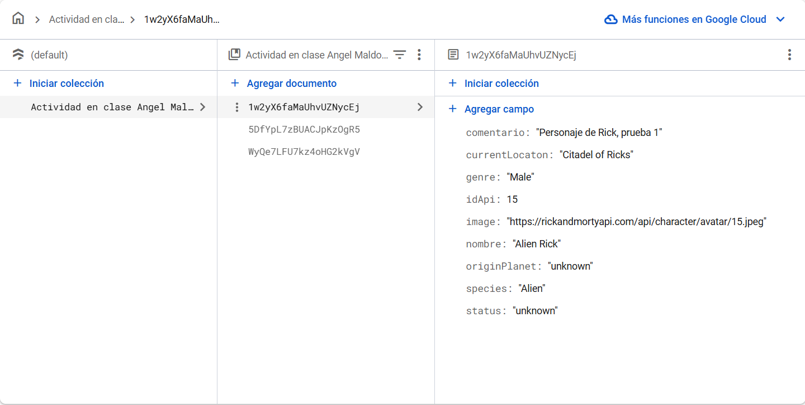

# Rick and Morty Characters - App

## Descripción

Aplicación móvil desarrollada con *Angular* e *Ionic* que permite buscar personajes de la serie *Rick and Morty, mostrar sus detalles, agregar comentarios y guardar la información en **Firebase*.

---

## Funcionalidades

### Parte 1

- Buscador de personajes por nombre.
- Mostrar resultados con links que redirigen a la página de detalles del personaje seleccionado.

### Parte 2

- En la página de detalles, se añade una caja de texto para ingresar comentarios sobre el personaje.

### Parte 3

- Guardar en Firebase Firestore la información del personaje, incluyendo nombre, estado, especie, ruta de la imagen y comentarios.

---

## Capturas de pantalla
 - Página inicial

 - Búsqueda de personaje

 - Límite de la búsqueda con el infinite scroll

 - Página con los detalles del personaje buscado

 - Comentario agregado

 - Documento registrado en la base de datos
